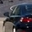
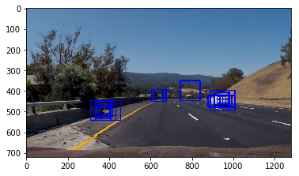

##Writeup Template

---

**Vehicle Detection Project**

The goals / steps of this project are the following:

* Perform a Histogram of Oriented Gradients (HOG) feature extraction on a labeled training set of images and train a classifier Linear SVM classifier
* Optionally, you can also apply a color transform and append binned color features, as well as histograms of color, to your HOG feature vector. 
* Note: for those first two steps don't forget to normalize your features and randomize a selection for training and testing.
* Implement a sliding-window technique and use your trained classifier to search for vehicles in images.
* Run your pipeline on a video stream (start with the test_video.mp4 and later implement on full project_video.mp4) and create a heat map of recurring detections frame by frame to reject outliers and follow detected vehicles.
* Estimate a bounding box for vehicles detected.

## [Rubric](https://review.udacity.com/#!/rubrics/513/view) Points
###Here I will consider the rubric points individually and describe how I addressed each point in my implementation.  

###Histogram of Oriented Gradients (HOG)

####1. Explain how (and identify where in your code) you extracted HOG features from the training images.

The code for this step is contained in the first code cell of the IPython notebook (HOG Classifier part).  

I started by reading in all the `vehicle` and `non-vehicle` images.  Here is an example of one of each of the `vehicle` and `non-vehicle` classes:

   

I then explored different color spaces and different `skimage.hog()` parameters (`orientations`, `pixels_per_cell`, and `cells_per_block`).  I grabbed random images from each of the two classes and displayed them to get a feel for what the `skimage.hog()` .

Here is an example using the `YCrCb` color space and HOG parameters of `orientations=9`, `pixels_per_cell=(8, 8)` and `cells_per_block=(2, 2)`:   

(example of YCrCb channel 0)   

####2. Explain how you settled on your final choice of HOG parameters.

I tried RGB, HLS, YCbCr for color feature and LUV, YCrCb for HOG feature.     
- I chose YCrCb and HLS for color and YCrCb for HOG, because YCrCb is better for derivative of pixels, and Hue is robust for shadow.  

I also tried various combinations of parameters and resulted in orientation=9, pixels_per_cell = (8,8), and cells_per_block=(2,2).   
- One big reason was culculation dimension (if I take pixels_per_cell = (16,16) and cells_per_block=(3,3) => 6x6x3x3 : 324 (x orientation) >> pixels_per_cell = (8,8) and cells_per_block=(2,2)  => 7x7x2x2 : 196 (x orientation).    
- And from the point of base size (64x64 pixels images), pixels_per_cell should keep image contour.   

####3. Describe how (and identify where in your code) you trained a classifier using your selected HOG features (and color features if you used them).

- Firstly, I used Standardization of training data of Concatenated information: Color spatial and histogram with YCrCb & HLS and HOG YCrCb 3 channel.  
- Secondly, I picked PCA to reduce dimension.  Original dimension was over 11,000, then using PCA I reduced dimension to 20 for reduction of calculation burden.  
- Then, I separate Training data and Test data, then trained a Random Forest with 20 estimatros.   I tried Linear SVM, but I chose Random Forest since it was faster to calculate and had higher accuracy.

###Sliding Window Search

####1. Describe how (and identify where in your code) you implemented a sliding window search.  How did you decide what scales to search and how much to overlap windows?

I decided to search with scaler with window size of 64 pixels.  scaler has [0.9 and 1.5] in order to detect close position and far position objects.  Trained image size is 64x64 and objects appears in image with size of 55 to 100, thus I choose [0.9 and 1.5] scale combination.  Of course, scaler should have more scales, if you have good speed calcuation PC.
  

####2. Show some examples of test images to demonstrate how your pipeline is working.  What did you do to optimize the performance of your classifier?

- Augment data: after training and passed through video process, I obtained video stream.  From images of video, I got pixel position of false posives.  Then augumented that images to dataset and retrained.

- I searched on two scales using YCrCb 3-channel HOG features plus spatially binned color and histograms of color of YCrCb and HLS in the feature vector.   

- I set smaller scaler to detect car in order to exceed heatmap threshold, since car feature is more solid compared to feature of false positives.  

---

### Video Implementation

####1. Provide a link to your final video output.  Your pipeline should perform reasonably well on the entire project video (somewhat wobbly or unstable bounding boxes are ok as long as you are identifying the vehicles most of the time with minimal false positives.)
Here's a [link to my video result](./output_images/project_video.mp4)   

####2. Describe how (and identify where in your code) you implemented some kind of filter for false positives and some method for combining overlapping bounding boxes.

I recorded the positions of positive detections in each frame of the video.  From the positive detections I created a heatmap and then thresholded that map to identify vehicle positions in order to avoid picking false positives.  I then used `scipy.ndimage.measurements.label()` to identify individual blobs in the heatmap.  I then assumed each blob corresponded to a vehicle.  I constructed bounding boxes to cover the area of each blob detected.  

Here's an example result showing the heatmap from a series of frames of video, the result of `scipy.ndimage.measurements.label()` and the bounding boxes then overlaid on the last frame of video:

---

###Discussion

####1. Briefly discuss any problems / issues you faced in your implementation of this project.  Where will your pipeline likely fail?  What could you do to make it more robust?

I couldnot find solution for:  
- "Overlap of cars" : even in occulusion, object should be sperately identified or predicted of its move.    
- Smooth detection: images should be carried its detection position of previous frames  

